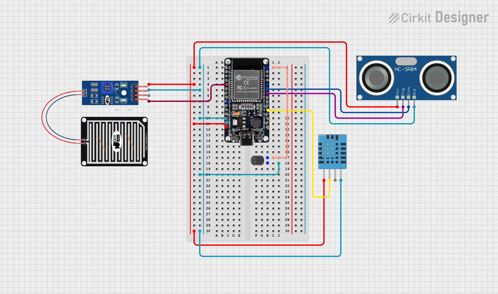

# IoT-Based Flood Early Warning System Using Thinger.io for Real-Time Data Visualization

  

## Project Domain
This project presents an Internet of Things (IoT) solution designed for disaster mitigation, specifically focusing on a Flood Early Warning System (EWS). It features real-time monitoring of river water levels, rainfall intensity, and environmental conditions (temperature and humidity) to bridge the information gap between upstream conditions and downstream residential areas. The system integrates digital notifications via Telegram and visual data tracking through the Thinger.io cloud platform to ensure residents can evacuate timely during extreme weather or nighttime.

## Table Of Contents
- [Background](#background)
- [Prerequisites](#prerequisites)
- [System Diagrams](#system-diagrams)
- [Demo and Evaluation](#demo-and-evaluation)
- [Conclusion](#conclusion)
- [Team](#team)

---

## Background

### Problem Statements
1. Traditional flood monitoring relies on manual visual checks, which are ineffective and dangerous during heavy rain, extreme weather, or at night.
2. There is a critical lack of real-time information regarding sudden water level rises in upstream areas, often resulting in downstream residents being unaware of incoming floods until it is too late.
3. As a tropical country with high rainfall, Indonesia (particularly regions like Sumatra) faces frequent hydrometeorological disasters that cause significant material loss and fatalities due to delayed evacuation.
   
### Goals
1. Establish a real-time and remote data transmission mechanism from flood-prone locations to a centralized monitoring system to overcome visual limitations.
2. Achieve high accuracy and low latency in detecting water level increases and delivering emergency notifications to the community.
3. Implement a tiered warning system (Waspada, Siaga, Awas) to provide clear urgency levels for community response and evacuation.

### Solution Statements
1. Use an ESP32 microcontroller as the primary processing unit to handle multi-sensor data and Wi-Fi connectivity.
2. Incorporate an HC-SR04 ultrasonic sensor for precise water level measurement, a DHT-11 sensor for ambient temperature and humidity, and a rain sensor to detect precipitation.
3. Utilize the MQTT (Message Queuing Telemetry Transport) protocol for efficient data transmission to Thinger.io, providing a real-time web-based dashboard for remote monitoring.
4. Integrate a Telegram Bot API for immediate smartphone notifications and a physical buzzer for local audible alarms when water levels reach dangerous thresholds.

---

## Prerequisites

### Hardware Specifications

- **Microcontroller:** ESP32 DEV KIT v4
- **Sensors:** Temperature Sensor (DHT-11), Ultrasonic Sensor (HC-SR04), & Rain Drop Sensor
- **Actuators:** Buzzer
- **Connectivity:** WiFi
- **Power Supply:** Direct USB Cable

### ESP32 Datasheet

### Thinger.Io Interface

### Telegram Interface

## System Diagrams

1.  **Block Diagram**

    

2.  **Sequence Diagram**

    

3.  **Flow Diagram**

    

4.  **Schematic**

    

## Demo and Evaluation
### Demo Link : https://youtu.be/uSfvWD3atIk?si=YR0Dsns08SiuMoGj

- **Setup:** Assemble all components based on the provided schematic diagram. Once the hardware is connected, upload the source code to the ESP32 microcontroller.
- **Demo:** The demonstration will showcase the system's core functions, including real-time temperature and water level monitoring. It will also feature the remote activation of the servo motor to dispense feed and the water pump to provide drinking water.
- **Evaluation:** To assess performance and durability, the system will be tested in a real-world environment, such as a chicken coop. This evaluation will measure the device's robustness and effectiveness under actual operational conditions.

## Conclusion
This IoT project can save cost, time, and effort for chicken farmers. Its automatic features can provide benefits for chicken farmers. With this product we can also bring a better life with future technology. As long as we can use this product well, we can develop chicken farming with better techniques and provide better efficiency for other activities.

## Team
1. fanTaux (https://github.com/fanTaux)
2. cayo-py (https://github.com/cayo-py)
3. RisangDananJoyo (https://github.com/RisangDananJoyo)
